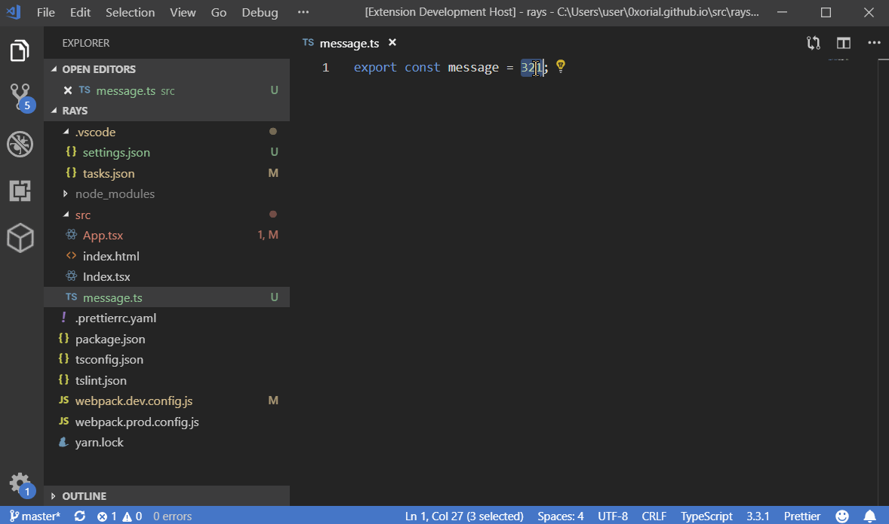

# webpack-dev-server integration into Visual Studio Code

This plugins provides an integration of webpack-dev-server, which is a bit more convenient than running it through tasks/terminal.
To start, execute command 'Start webpack-dev-server'.

## Features

 - clearly shows when compilation is in progress
 - provides a separate view of errors detected by webpack compilation

## Why not use tasks with appropriate problem matchers?
While this solution seems to fit much better into overall design of vscode there are few problems with it currently:
 - it is difficult to impossible to parse multi-line errors.
 - it is very difficult to parse errors which are coming from different webpack plugins and have different format.
 - problems do not clear properly. https://github.com/Microsoft/vscode/issues/66982#issuecomment-457675452
